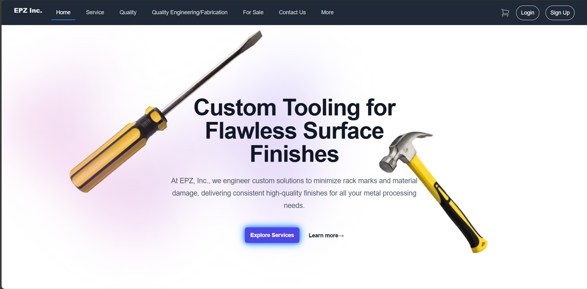
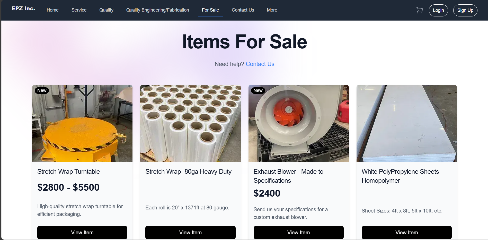
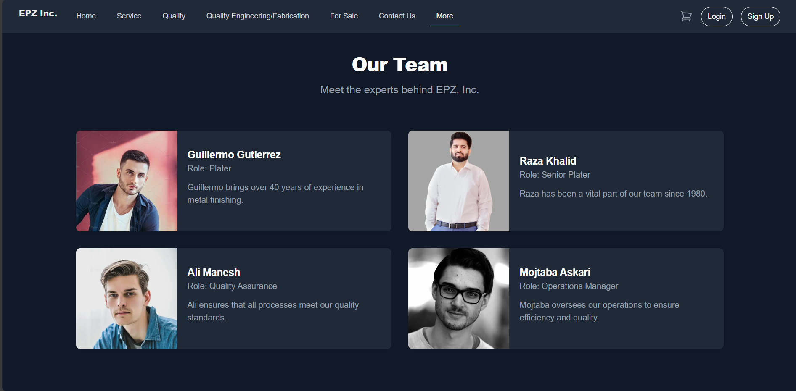
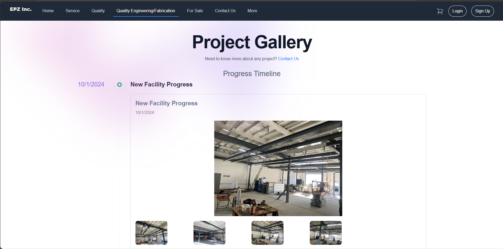
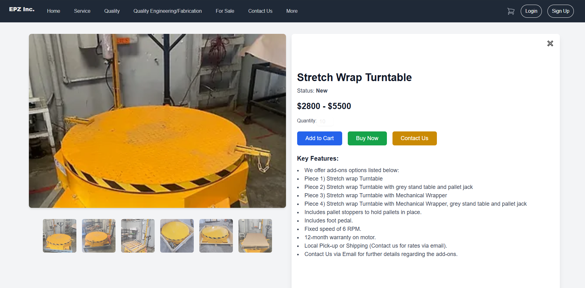
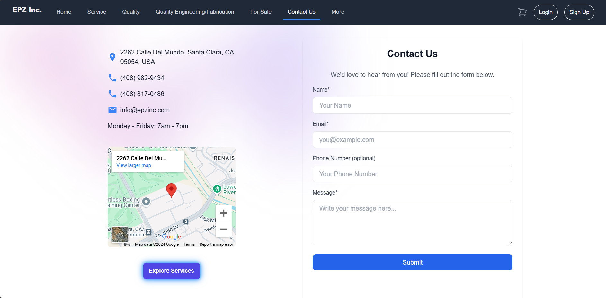
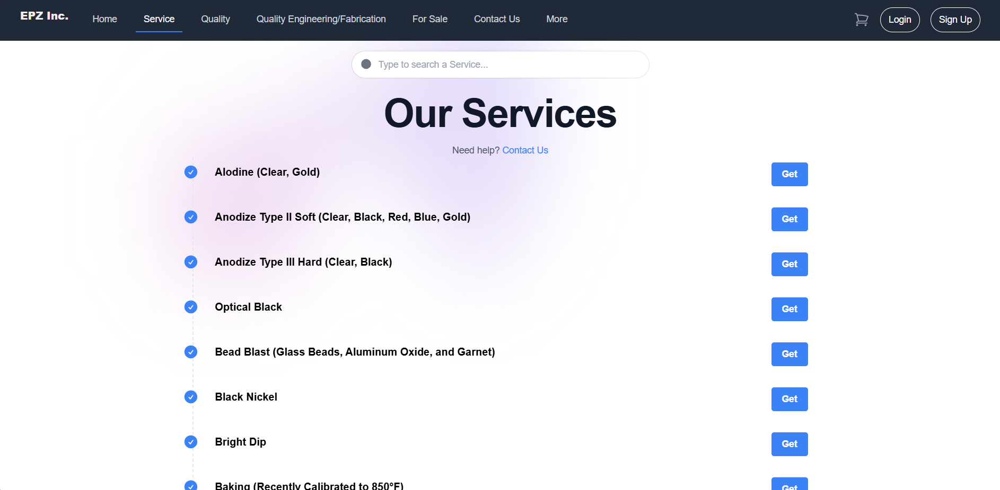
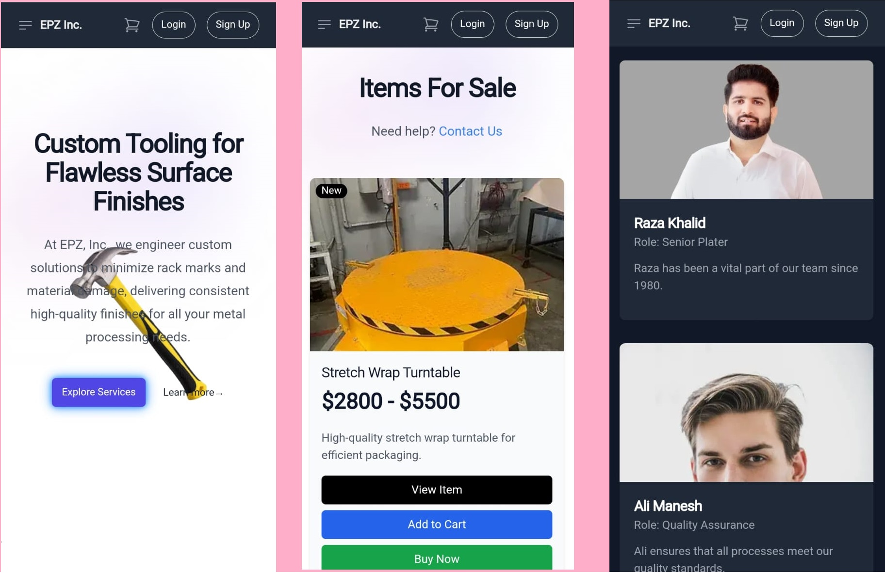

# EPZ Inc. Project

Welcome to the EPZ Inc. project! 

Visit the project live at [https://epzinc.vercel.app/home](https://epzinc.vercel.app/home).

## Technologies Used

- **Next.js**: A React framework for server-side rendering and static website generation.
- **Tailwind CSS**: A utility-first CSS framework for creating custom designs quickly.

## Sample Images Deskop View

Here are some sample images from the project:

 
 
 
 
 
 
 

## Sample Images Mobile View

 


## Installation

To get started with this project, clone the repository and install the dependencies:

```bash
git clone https://github.com/your-username/epzinc.git
cd epzinc
npm install
```